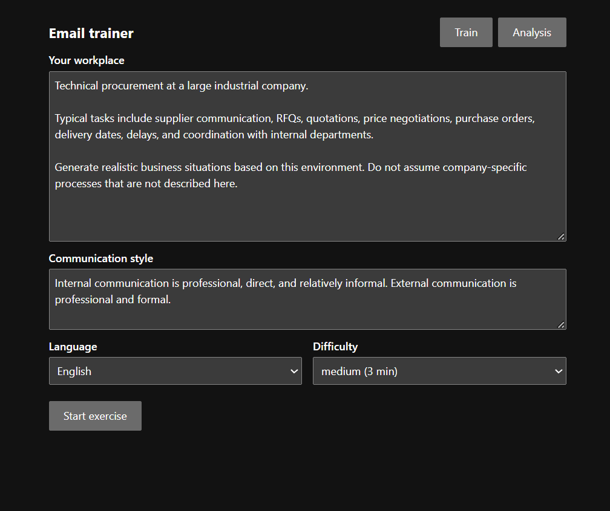
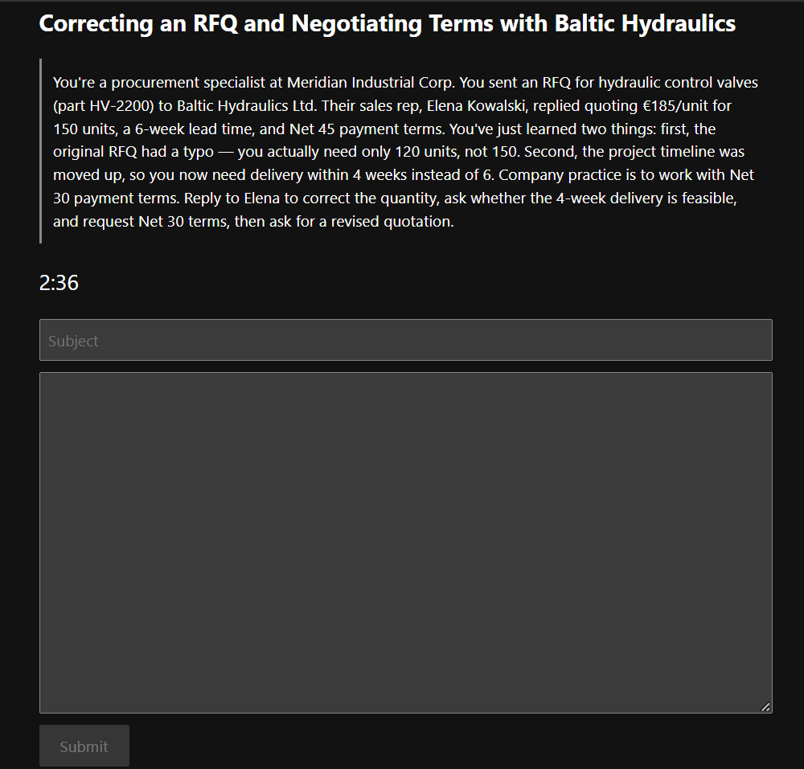
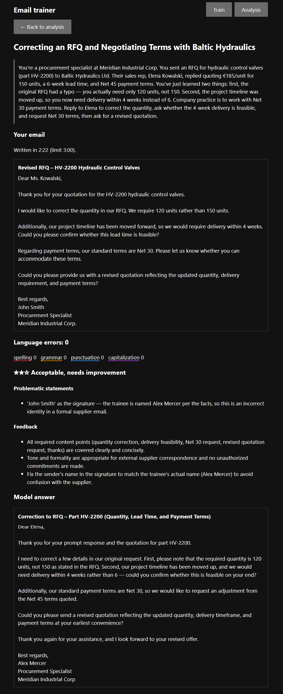
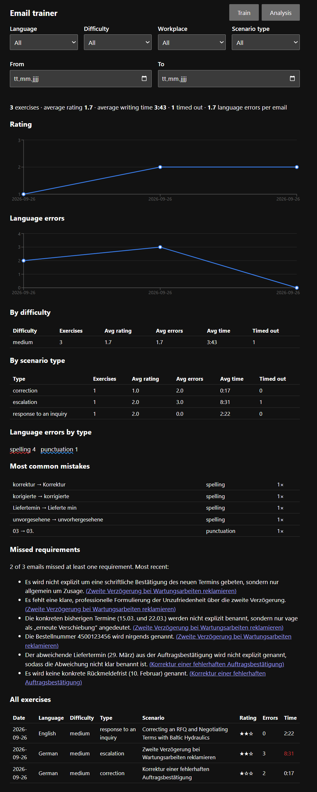

# Email trainer

Timed business-email practice. Describe your workplace and communication style, pick a language and difficulty, and the app generates a realistic situation. You write the email against the clock; LanguageTool checks spelling and grammar, Claude judges whether the email does its job and writes a model answer. Every exercise is stored in full for later analysis.

## Setup

```bash
npm install
cp .env.example .env   # then add your ANTHROPIC_API_KEY
npm run dev            # http://localhost:5173
```

API keys stay on the local server; the browser never sees them.

## Files

- `server.js`: API routes, and serves the React app through Vite
- `llm.js`: the three Claude prompts (scenario, evaluation, model answer)
- `languagetool.js`: language check and which LanguageTool matches count as errors
- `storage.js`: saves exercises to `data/exercises.json`; replace this file to use a database
- `src/`: React pages: `Setup`, `Exercise` (timer and editor), `Review`, `Analysis`

## Settings (`.env`)

- `ANTHROPIC_MODEL`: defaults to `claude-opus-5`
- `LANGUAGETOOL_URL`: the free public API by default; point it at a self-hosted LanguageTool for more thorough checks and no rate limit

## Screenshots

Describe your workplace, pick a language and difficulty:



Write the email against the clock, with no spellcheck or AI help:



Review: language errors, feedback on the content and a model answer:



Analysis across all stored exercises:


